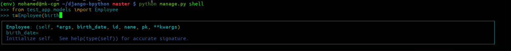
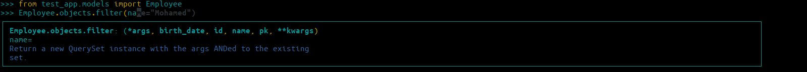

# bpython-django

This project is based on [bpython](https://github.com/bpython/bpython) REPL, I liked it very much but it missed some features for Django, like
* Autocomplete the constructor for the model,
* Autocomplete the attribute name on ModelManager functions like 'filter()' and 'get()'

## Examples

## Install

`pip install bpython-django`

## Usage

`python manage shell`
or 
`python manage shell -i bpython`